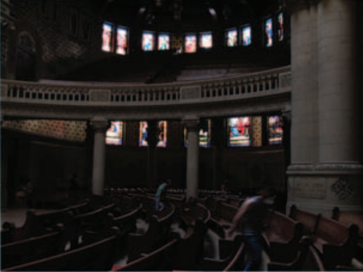
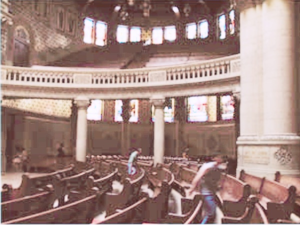
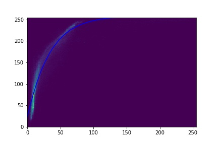
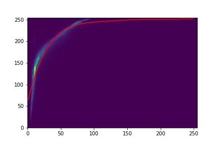
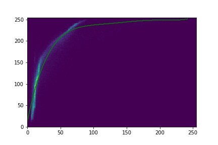

# Introduction
This repository contains code for this [paper](https://www.researchgate.net/publication/224114693_Image_enhancement_method_via_blur_and_noisy_image_fusion\n)

# Usage
1. Clone this repository
2. Install required packages (with Python > 3.6):\
    `pip install -r requirements.txt`
3. Put your images to main folder, save images name as `<name>_short_exposed.jpg` and `<name>_long_exposed.jpg` correspond to short and long-exposed image respectively.
4. There are 2 ways to run the code:
    1. Simply run `!python enhance.py <name>` in your terminal
    2. Use `photometric_calibration.py` to get photometric calibrated image.  
        Use `fusion.py` to get the fusion image.  
        A guide notebook is provided in the `quickstart.ipynb` file.
5. The results are saved in `output` folder as  `pced_<name>.jpg`, `fused_<name>.jpg` and 3 `coparagram_<color>.jpg` correspond to photometric calibrated, fusion and 3 coparagrams for each channel in rgb color space respectively.

# Demo
  
 

     

*Image enhancement result: short and long-exposed images (upper row), the photometrically calibrated short-exposed image (second row left), and the result (second row right), comparagram for 3 color channels (bottom row)*

# Conclusion
The results in this code is not exactly the same as the paper, because of our lack of knowledge in image processing. There are some problems, such as:
1. In photometric calibration, we use the linear regression for polynomial to fit the data, which is not the best way, because it is sensitive to the outliers. 
2. In fusion, we estimate the noise variance by a simple function, not the way in the paper.
3. Our result on the demo image maybe better than the original, but in experiments, the results are not always good. It usually work well when long-exposed image is brighter than short-exposed image a lot.
# Contributors
* Duong Quang Tung - 19020654
* Trang Minh Ngoc - 19020588
* Le Thi My Duyen - 19020535
  

